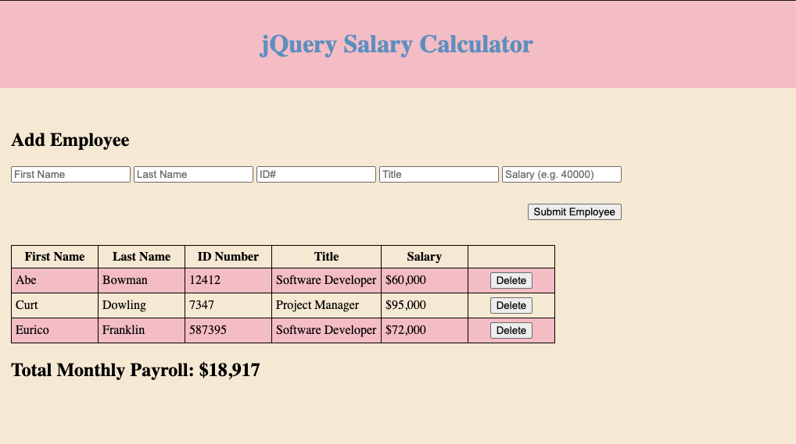

# jQuery Monthly Salary Cost

## Description

_Duration: Weekend_

This page calculates the monthly payroll of employees that the user enters. When the payroll exceeds $20,000, the user is alerted with a red background color. 

## Screen Shot

## Installation

Download the repository, then open index.html in your browser to begin usage. 

## Usage

- Add an employee to the table using the input fields and submit button.
- When employee is added, monthly payroll will be calculated based on the cumulative salaries of all employees in the table. 
- If you want to delete an employee from the table, there is a button in the far right column of the table to do so.
- When an employee is deleted, the monthly payroll will be recalculated.
- If an input field is missing a value, an error message will be displayed and the table will not be appended.

## Built With

HTML, CSS, javascript, jQuery.

## Acknowledgement
Thanks to [Prime Digital Academy](www.primeacademy.io) who equipped and helped me to make this application a reality. (Thank your people)
